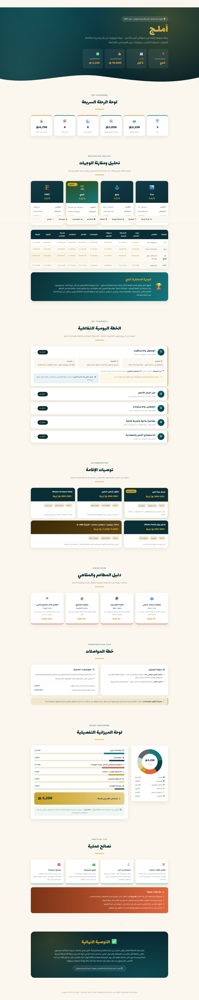

# 🌊 Red Sea Travel Planner

An interactive AI-generated luxury travel planner for Saudi Red Sea destinations, built using Prompt Engineering and Claude.

## ✨ Overview

This project presents a premium 5-day summer travel plan to Umluj, Saudi Arabia.

The goal was not only to generate a normal itinerary, but to create a visually appealing interactive travel experience that includes destination comparison, daily planning, budget analysis, hotel recommendations, restaurants, transportation, and travel tips.

## 🌐 Live Demo

[View the live website](https://reman205.github.io/red-sea-travel-planner/)

## 🚀 Features

- Destination comparison
- Selected destination highlight
- Interactive 5-day itinerary
- Hotel recommendation cards
- Restaurant and café guide
- Transportation plan
- Budget dashboard
- Travel tips and safety notes
- Responsive design
- Arabic RTL layout

## 🛠 Built With

- Claude AI
- Prompt Engineering
- HTML
- CSS
- JavaScript
- GitHub Pages

## 🎯 Purpose

This project was created as part of the AI Agents Bootcamp to practice writing structured prompts that produce high-quality, organized, and presentation-ready outputs.

## 📌 Key Learning

A well-designed prompt can transform a simple request into a complete interactive experience with clear structure, realistic constraints, and professional presentation.

## 👩‍💻 Author

Reman Ghawanni
